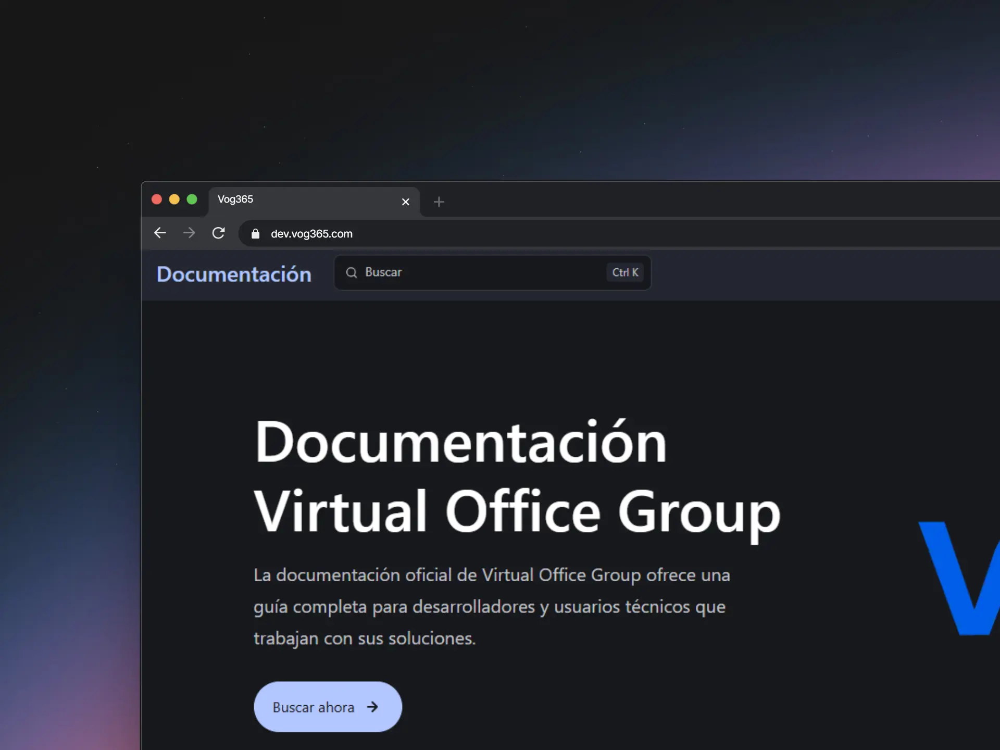

# Documentación Virtual Office Group C.A

[](https://starlight.astro.build)




## 🚀 Estructura del Proyecto

Dentro de tu proyecto Astro + Starlight, verás las siguientes carpetas y archivos:


```
.
├── public/
├── src/
│   ├── assets/ Recursos (Imagenes,videos, Archivos)
│   ├── content/
│   │   └── docs/ Documentación principal
│   └── content.config.ts
├── astro.config.mjs
├── package.json
└── tsconfig.json
```

Starlight busca archivos **.md** o **.mdx** en el directorio `src/content/docs/`. Cada archivo se expone como una ruta según su nombre.

Se pueden agregar imágenes a `src/assets/` e incrustarlas en Markdown con un enlace relativo.

Los activos estáticos, como los faviconos, se pueden colocar en el directorio `public/`.

## Requisitos

Asegúrate de tener instalados los siguientes elementos:
- **Node.js**: v18.14.1 o superior.
- **pnpm**: `npm install -g pnpm`

## Pasos para probar localmente

### Clonar el repositorio
Utiliza Git para clonar el proyecto en tu máquina local:

```
git clone https://github.com/Virtual-Office-Group/vog-docs.git
```
### Instalar dependencias con pnpm

Asegúrate de tener pnpm instalado y ejecuta en la carpeta raiz el siguiente comando en la terminal:

```
    pnpm install
```

### Iniciar el modo desarrollo

Ahora puedes ejecutar Starlight localmente:

``` 
    pnpm dev
```
## 🧞 Comandos

Todos los comandos se ejecutan desde la raíz del proyecto, desde una terminal:

| Comando                | Acción                                           |
| :------------------------ | :----------------------------------------------- |
| `pnpm install`             | Installs dependencies                            |
| `pnpm dev`             | Inicia el servidor de desarrollo en `localhost:4321`      |
| `pnpm build`           | Construye tu sitio en producción to `./dist/`          |
| `pnpm astro ...`       | Run CLI commands like `astro add`, `astro check` |
| `pnpm astro -- --help` | Get help using the Astro CLI                     |

## 👀 ¿Quieres saber más?

Consulta la [Documentación de Starlight](https://starlight.astro.build/es/), lee la [Documentación de Astro](https://docs.astro.build/es/getting-started/)
