import { Card, CardGrid } from '@astrojs/starlight/components';

## Implementación Dynamics 365 Customer Service.

Al ingresar al entorno de Dynamics 365, el usuario puede visualizar las aplicaciones centrales diseñadas para la atención al cliente.

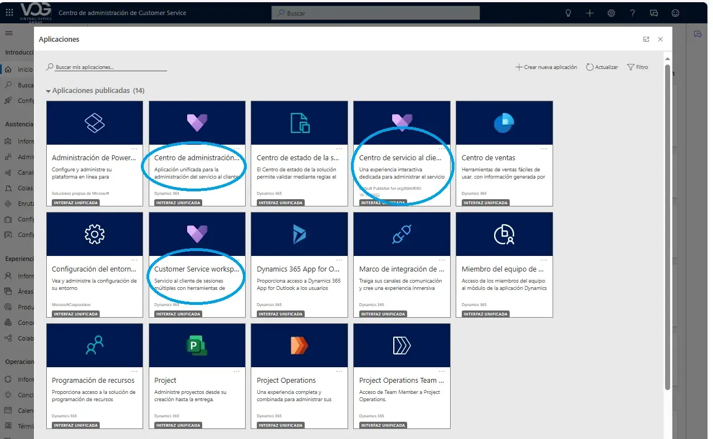

Para comenzar, debe configurar la aplicación accediendo al Centro de administración de Customer Service 365. Desde allí, podrá realizar la configuración inicial del canal que se utilizará para la gestión del servicio.

Al completar la configuración del canal, se generarán automáticamente los registros de colas predeterminadas junto con la estructura de enrutamiento de registros.

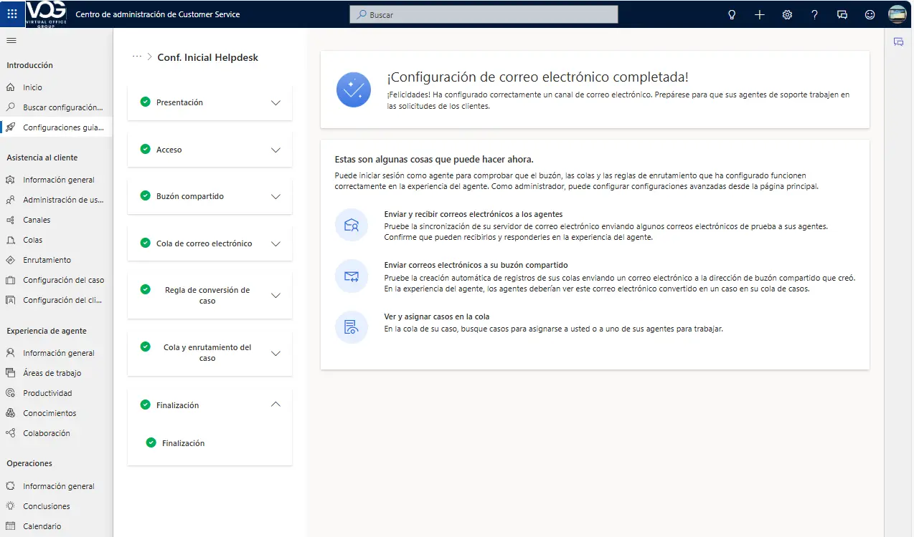

*Entre las áreas a configurar se encuentran:*

- ***Asistencia al cliente:***

                *Usuarios*

                *Canales*

                *Colas*

- ***Experiencia del agente:***

               *Áreas de trabajo*

               *Productividad*

              *Conocimientos*

              *Colaboración*

- ***Operaciones:***

               *Calendario*

               *Términos de servicios*

               *Programación  de servicios*

Observemos las colas predeterminadas que ayudaran a la asignación y seguimiento de actividades para los agentes.

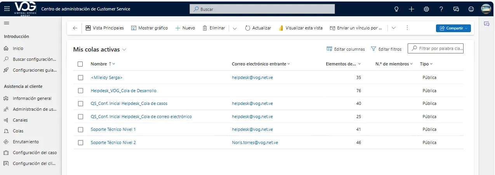

El enrutamiento básico de los registros.

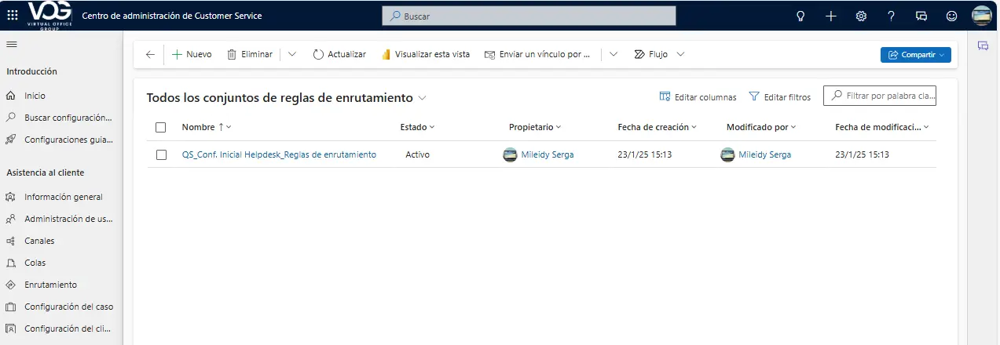

Así cómo la regla de creación y actualización de registros.

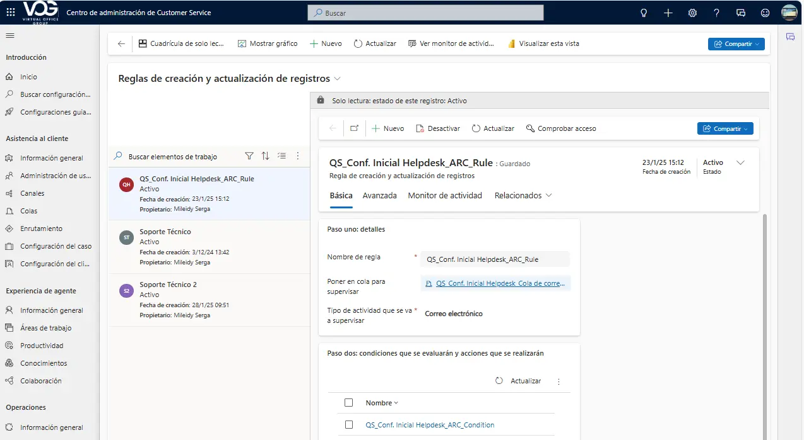

La configuración incluye la definición de perfiles para cada Área de trabajo.

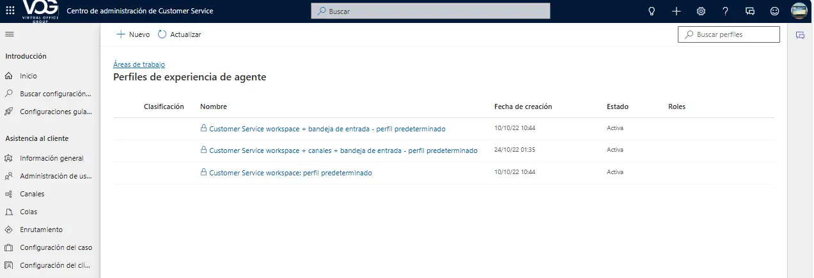

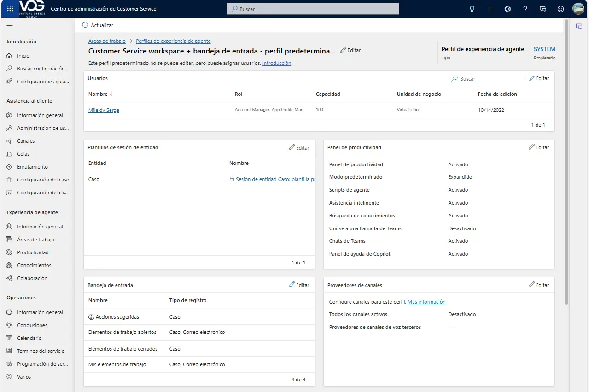

y el área de productividad, donde se habilitan características como Copilot y las funcionalidades de IA.

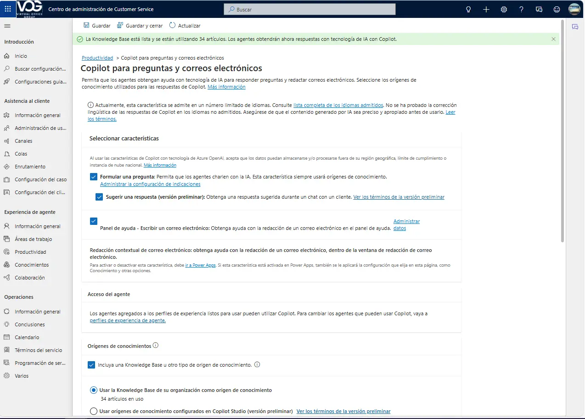

Una de las principales innovaciones es la creación de conocimiento asistida por Copilot, que permite generar contenido de forma inteligente y automatizada.

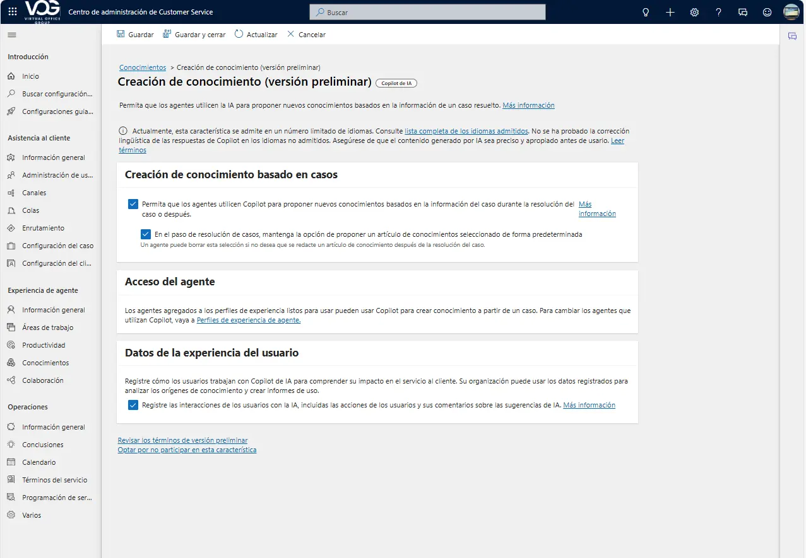

El sistema mostrará la funcionalidad de integración y colaboración a través del chat de Microsoft Teams.

Se configuran los Acuerdos de Nivel de Servicio (SLA) para definir los tiempos de respuesta y resolución.

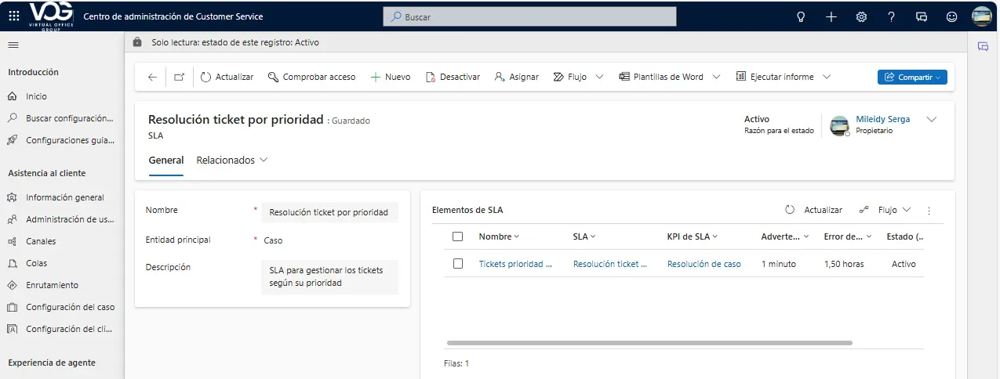

Se configuran los Indicadores Clave de Desempeño (KPI) que permitirán monitorear las métricas de eficiencia y calidad.

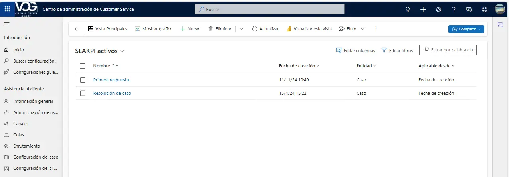

Gestión de Términos y condiciones para el servicio. Derechos

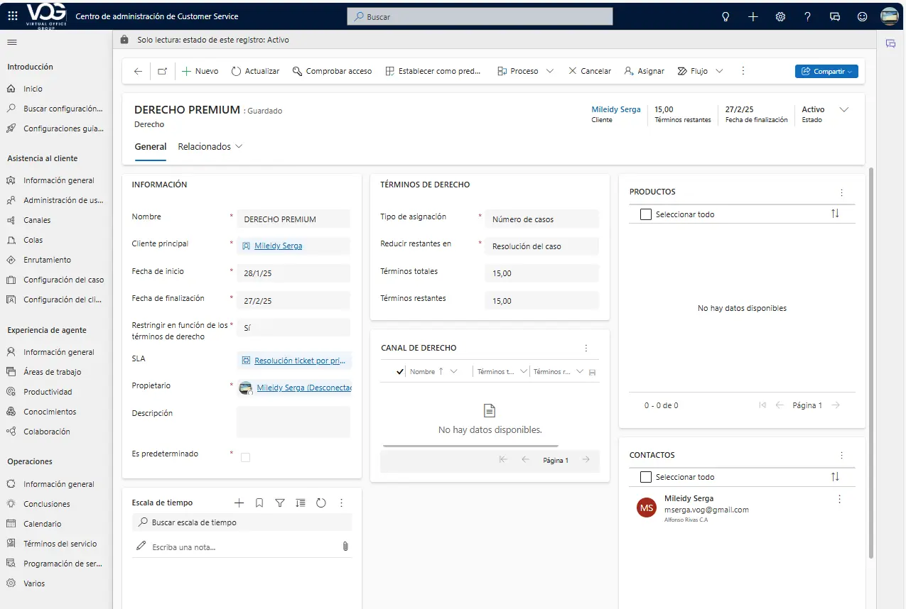

*Entre las aplicaciones de atención al cliente disponibles, también se incluyen:*

- ***Customer Service Workspace:** Es una aplicación diseñada para que los agentes gestionen múltiples casos y conversaciones de manera eficiente.*

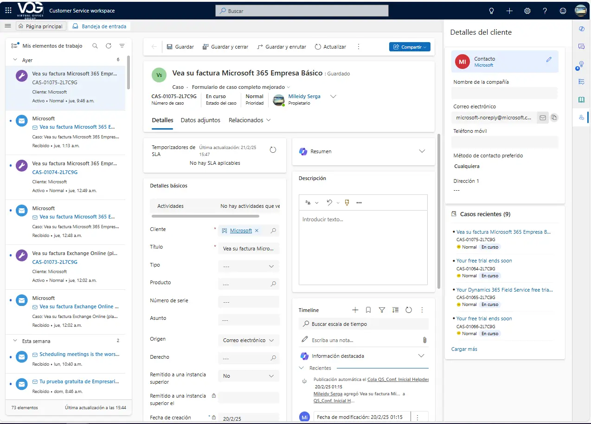

*Entre las características principales se observan:*

- *Copilot*
- *Chat de Teams*
- *Asistencia Inteligente*
- *Scripts de agente*
- *Búsqueda del conocimiento.*

<CardGrid>
  <Card title="Copilot">
    - *Respuesta a Preguntas: Un agente puede utilizar Copilot para obtener respuestas rápidas a preguntas frecuentes sobre productos o servicios, mejorando la eficiencia y reduciendo el tiempo de espera del cliente.*
    - *Redacción de Correos Electrónicos y Respuestas de Chat: Un agente puede pedir a Copilot que redacte una respuesta de chat para un cliente que tiene un problema técnico, incluyendo pasos detallados para resolver el problema.*
    - *Resumen de Casos y Conversaciones: Al final de una interacción, un agente puede pedir a Copilot que resuma la conversación y las acciones realizadas, facilitando el seguimiento y la documentación del caso.*
  </Card>
  <Card title="" icon="">
    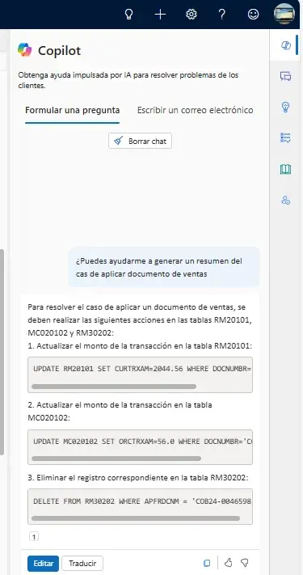
  </Card>
</CardGrid>

<CardGrid>
  <Card title="Chat de Teams">
    Cuando la función está activada para una aplicación, los agentes que trabajan con registros de clientes pueden iniciar un nuevo chat o conectar un chat existente a un registro. Pueden colaborar de manera eficiente sin cambiar de contexto ni salir de la aplicación. Conectar todos los chats asociados a un registro puede ayudar a los agentes a mantener todos los chats relacionados con el registro en un solo lugar.
  </Card>
  <Card title="" icon="">
    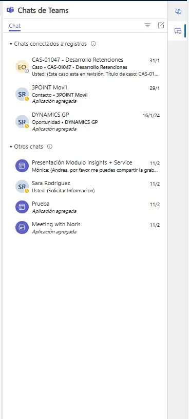
  </Card>
</CardGrid>

La aplicación Customer Service completa el ecosistema con funcionalidades para la gestión de casos, bases de conocimiento y análisis, dirigidas a elevar los niveles de satisfacción del cliente.

 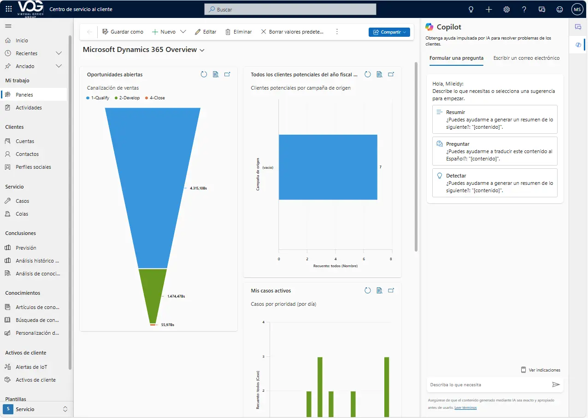

 Con estos pasos completados, el entorno de Customer Service estará completamente operativo, permitiendo comenzar con la gestión de casos, el seguimiento de SLA, y la atención a través de los múltiples canales configurados.