*Al ingresar a Dynamics 365 Business Central, el primer paso es realizar la configuración inicial mediante el asistente, accediendo a:*

*Configuración > Configuración asistida.*

*Desde allí, es posible gestionar la conexión con otros sistemas, como:*

*Configurar una conexión a Dataverse.*

*Configurar una conexión a Dynamics 365 Sales.*

Al configurar la conexión a dataverse, se debe especificar el entorno CRM que se va a integrar.

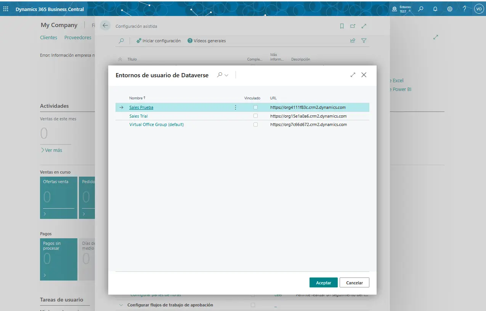

Observando así la conexión, integración y sincronización de las tablas involucradas.

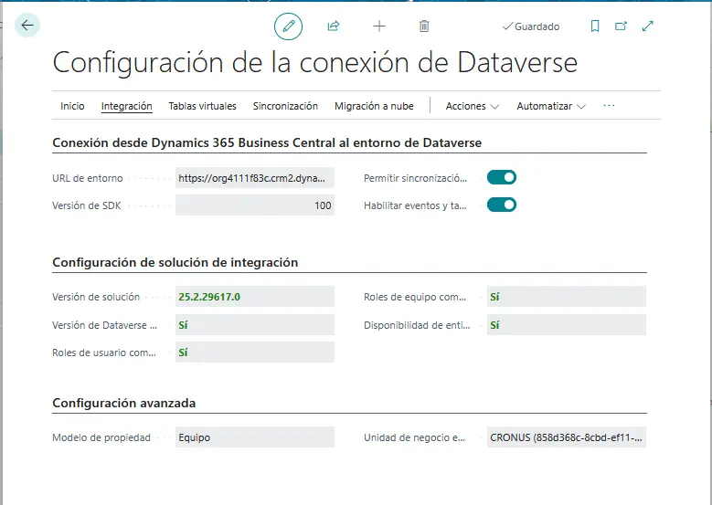

Posteriormente, se procede con la configuración específica de integración de Dynamics 365 Sales.

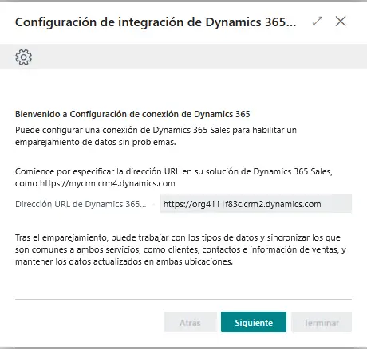

Para verificar la integración y sincronización de datos, se deben visualizar en Dynamics 365 Sales los siguientes registros provenientes de Business Central:

### Productos

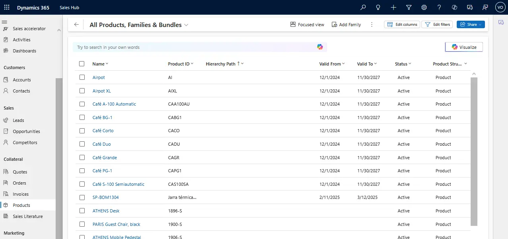

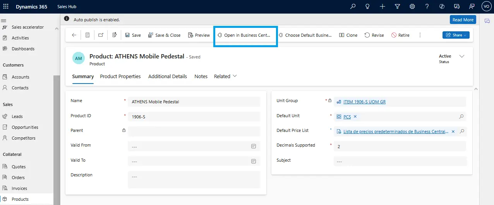

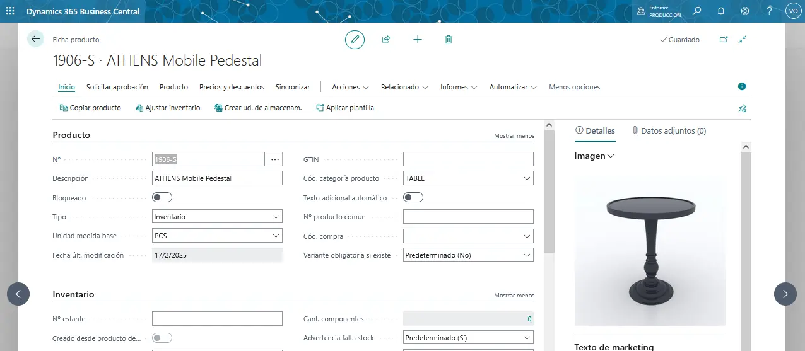

La integración entre sistemas permite que, al marcar un pedido como "Enviado" en Dynamics 365 Sales, este se registre automáticamente en Dynamics 365 Business Central.

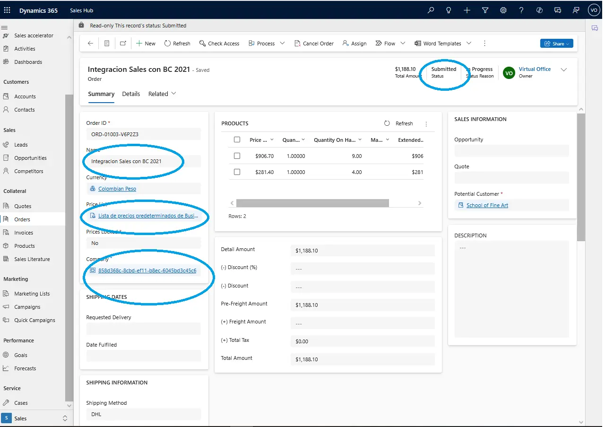

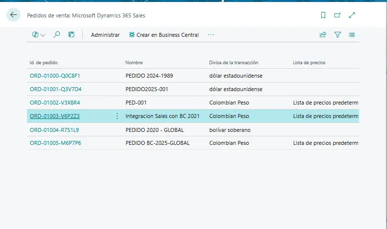

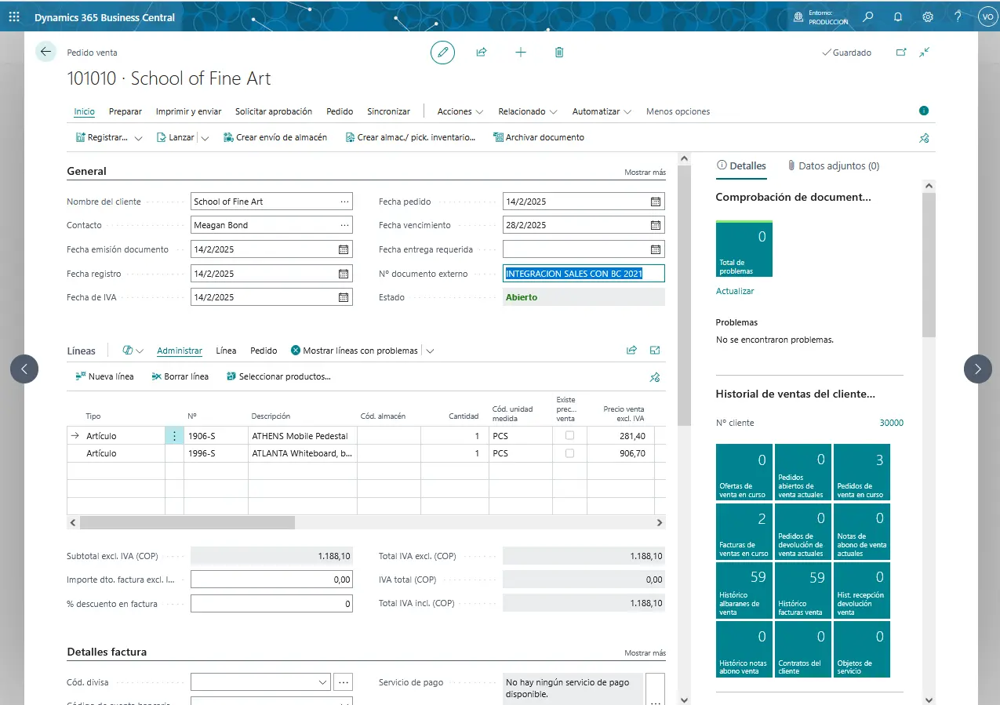

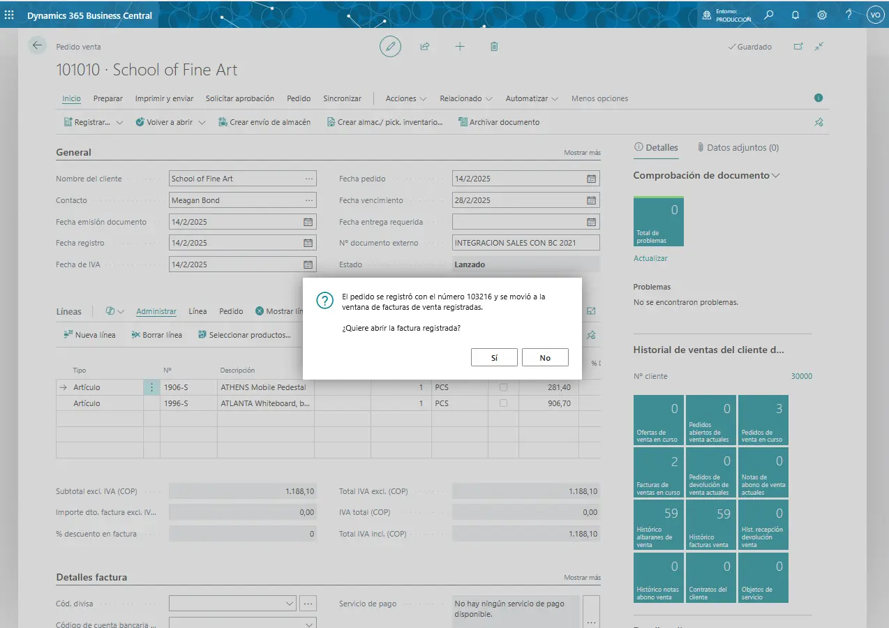

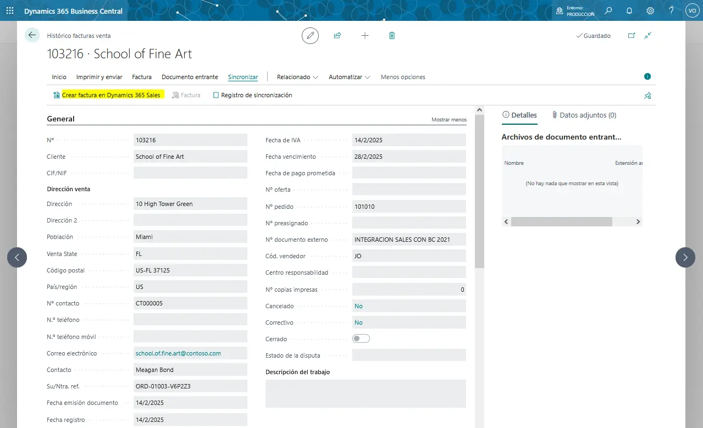

Dando como resultado la integración correcta en ambas aplicaciones.

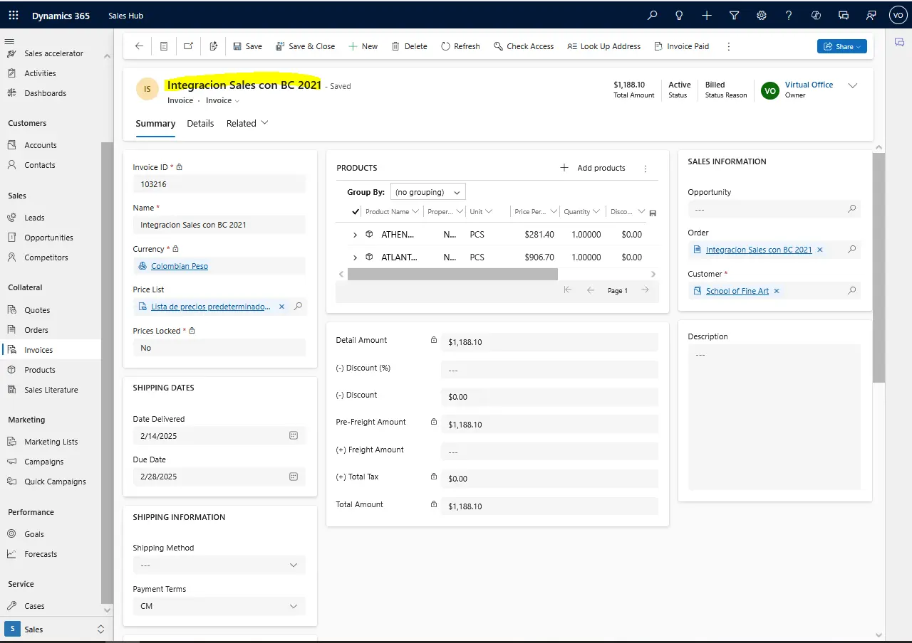

***Recursos involucrados para soporte:***

https://learn.microsoft.com/en-us/dynamics365/business-central/admin-common-data-service

https://learn.microsoft.com/en-us/dynamics365/business-central/admin-synchronizing-business-central-and-sales#standard-table-mapping-for-synchronization